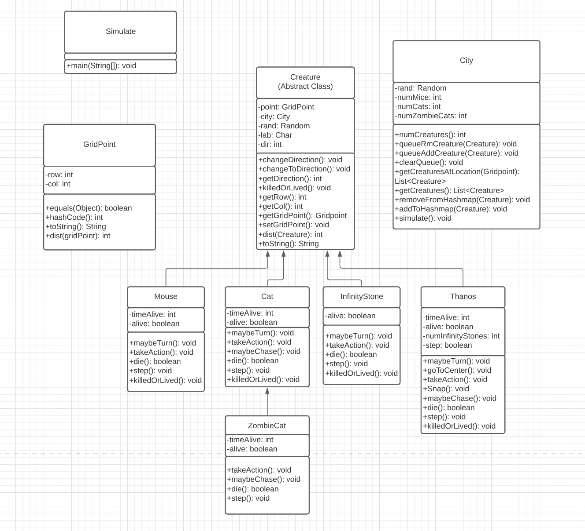

# Cat and Mouse Game


## Compiling

To compile the progam, use ```javac *.java```

To run the program use this format


```java Simulator Mice Cats ZombieCats rounds milliseconds| java -jar Plotter.jar```

Mice, Cats, and ZombieCats should be expressed as integers and representst the initial number of each creature.  

Rounds should be expressed as an integer that represents the number of rounds to iterate through before the program terminates.  

Milliseconds should be expressed as an integer value that represents the number of seconds between each iteration through the rounds.  

An example of what this code would look like would be

```java Simulator 50 25 12 1000 100| java -jar Plotter.jar```

This could also take a Debug add on that would show the round number in the center of the plotter and give the coordinates of each dot.  To use this, add the debug flag ```--DEBUG``` to the end of the command.  

This command would appear as

```java Simulator 50 25 12 1000 100| java -jar Plotter.jar --DEBUG```

## UML Design



## Creature

Creature is an abstract class that specific creatures are instances of.  There are methods in Creature that are used in these children classes.  because it is an abstract class it can have multiple inhertance which allows it to be used by multiple different creatures.  

## Mouse, Cat, InfinityStone, and Thanos OOP  

Mice, Cats, InfinityStone, and Thanos are all classes that inherit methods from creature.  They all inherit the methods changeDirection(), changeToDirection(), getDirection(), getRow(), getCol(), getGridPoint(), setGridPoint(), dist(), and toString().  Each children class also contains abstract classes maybeTurn(), takeAction(), die(), step(), and killedOrLived() that are implemented differently depending on which creatures is using them.  While all of them contain these same methods, they also have their own methods that they do not share with their parent class.  Thanos has methods such as Snap(), goToCenter(), many of the classes have the method maybeChase() which is used when a creature is chasing another creatures instead of randomly moving.  

### Mouse

Mice are represented by blue dots.  They move at 1 block per round and they always move randomly, they breed after 20 rounds and die after 100.  A new mouse is added every 100 rounds.  

### Cat

Cats are represented by yellow dots, they move at 2 blocks per round and unless they are chasing a mouse, they move randomly.  They do not breed and they die 100 rounds after they eat their last mouse.  When they die they become a zombie cat.  When a cat is within 20 blocks (manhatten distance) of a mouse it changes to a cyan dot and moves in the direction of that mouse, it moves by approaching the mouse through the distance that it is farther away from (for instance if the mouse is 8 blocks north and 6 blocks west it will jump north until the north distance is closer than the west distance, then it will move west).  This is generally how all creatures chase in this program.  A new cat is added every 25 rounds.  

### Thanos

Thanos is a creature inspired by the character Thanos and his actions in the Marvel Cinematic Universe.  In the movies, Thanos's planet was destroyed due to overpopulation so he vows to fix this problem for the whole universe by eliminating half of the creatures in the universe.  To do this, Thanos needs the 6 infinity stones that control different aspects of reality, once he has all 6 he snaps and half the creatures in the universe turn to dust.  In this program thanos does exactly that, there are 6 infinity stones scattered throughout the map and thanos tracks them down one by one at a speed of 1 block every 2 rounds.  Once he has all 6 infinity stones he moves to the center of the screen and snaps, eliminating half the creatures in the city (excluding himself).  Unfortunately, this takes about 600 rounds which is much longer thant the average lifspan of all the other creatures so there arent many creatures that die in the snap, but if you increase the lifespan of zombie cats to 700 then it works pretty well.  Thanos never moves randomly despite having code to.  Thanos also does not die.  

### InfinityStone

Infinity stones are added in pairs of 6, each being one of 3 colors pink, orange, and green.  They do not move, they do not eat, they only die when thanos catches them.  They are not actual creatures but this implementation of them was easy to use so it made sence to make them as such.  

### ZombieCat

ZombieCat is an instance of a Cat, it contains all the same methods in Creature, and in Cat, and it uses polymorphism to change some to do things such as target cats and mice instead of just cats, and take 3 steps per round instead of 2.  It is the only class that is extended from another instance of Creature.  

Zombie Cats are represented by red dots.  They move at 3 blocks per round and unless they are chasing a mouse or a cat they move randomly. They do not breed and they die after 200 rounds of not having eaten.  If they are within 40 blocks of a cat or a mouse then they turn black and chase that creature with the same chase function as used in cat.  if they eat a mouse then that mouse dies, if they eat a cat then it turns into a zombie cat.  